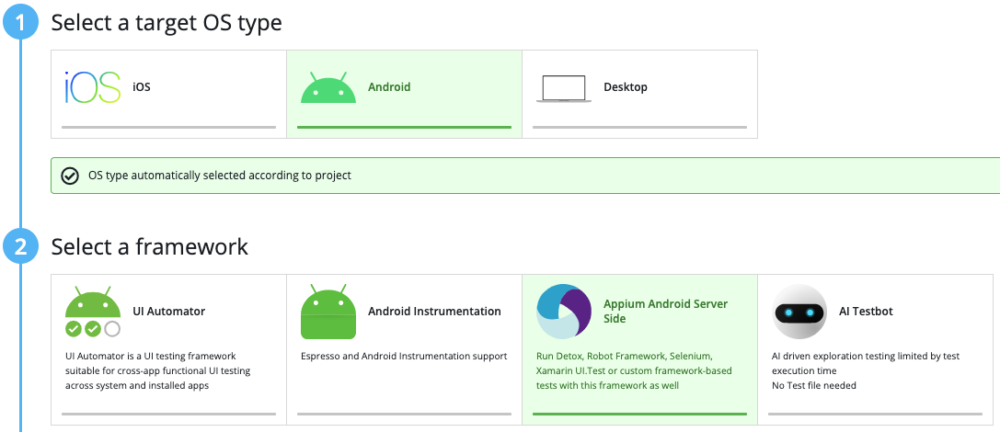
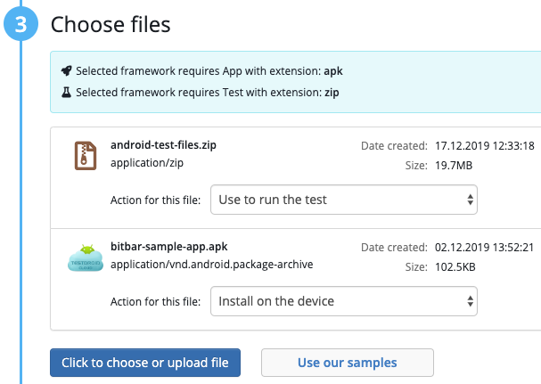
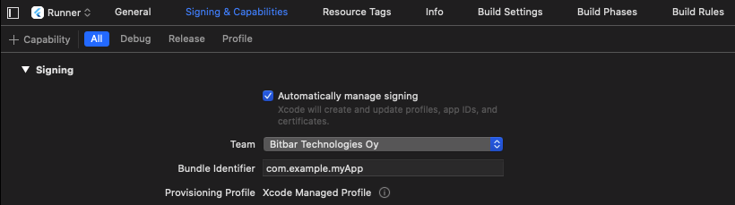
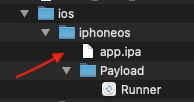
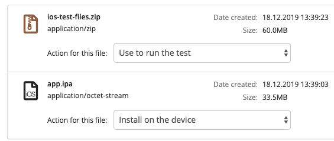

***Flutter Bitbar Cloud***
---------------------------

This sample demonstrates how to run Flutter tests in Bitbar Cloud. The sample is complete and should work "out of the box", except for iOS real device which needs to be run on your local computer first to build the app. Android tests and iOS simulator tests should work without needing to edit anything.

**How to make test run in Bitbar Cloud**

To make a test run in the cloud, first use the provided shell scripts `zip-test-files-android.sh` or `zip-test-files-ios-simulator.sh` to create test package zip file. The test package contains the app directory “my_app” and “run-tests.sh” -file. Upload this test package .zip file to “Appium Server Side” type project in Bitbar Cloud. Also upload some dummy .apk or .ipa file, for example bitbar-sample-app.apk from Bitbar github "test samples". “Appium Server Side” type project expects an .apk (or .ipa) file to be uploaded to test run. The actual flutter app is built during test run (except for iOS real device, see "Steps for Bitbar cloud iOS real devices test runs"). Note that the uploaded app needs to be able to install on real device, otherwise test will fail.

IOS simulator test run spends actual real device test time, real iOS device is idling while simulator is running tests (upload real device ipa also on simulator run, no simulator builds).

Select "Appium Server Side":

Upload test package and dummy app:

These are scripts for creating test package zip files for Android and iOS:
- *zip-test-files-android.sh*
  - creates android integration test package
  - upload dummy APK with this
  - uses run-tests file: `run-tests-android.sh`
- *zip-test-files-android-unit-widget.sh*
  - creates android unit and widget test package
  - upload dummy APK with this
  - uses run-tests file: `run-tests-android-unit-widget.sh`
- *zip-test-files-ios.sh* (iOS real device)
  - check `Steps for Bitbar cloud iOS real devices test runs` before creating test package
  - creates iOS integration test package
  - upload built Runner app converted to ipa with this
  - uses run-tests file: `run-tests-ios.sh`
- *zip-test-files-ios-simulator.sh*
  - creates iOS simulator integration test package
  - upload dummy ipa with this
  - uses run-tests file: `run-tests-ios-simulator.sh`
- *zip-test-files-ios-simulator-install-flutter.sh*
  - creates iOS simulator integration test package (install flutter, some cloud VMs might not yet have Flutter installed)
  - upload dummy ipa with this
  - uses run-tests file: `run-tests-ios-simulator-install-flutter.sh`

**Steps for Bitbar cloud iOS real devices test runs**

- No guarantee that this will work because of complicated iOS app signing.
- 32 bit iOS devices (iPads up to Air and iPhone 5c) and devices with OS version iOS 13 don't work at the moment with Flutter.
- Your Apple Development signing profile needs to be added to Runner target in XCode
- Runner app needs to be run locally and tests need to be run locally
- This Runner app is then converted to ipa and uploaded to Bitbar Cloud
- The app is re-signed in the cloud
- App will need to be moved to "build/ios/iphoneos/" -folder
- Test is run with "--no-build" -flag
- More info in iOS real device run-tests.sh file: `run-tests-ios.sh`
- *Follow these steps:*
  1. Open "Runner.xcworkspace" in XCode from "ios" folder and set your correct app signing "Team" (Runner target) (don't build)
  2. Close XCode
  3. Run app locally (inside "my_app" folder) with command: `flutter run`
  4. Run tests locally (inside "my_app" folder) with command: `flutter drive --target=test_driver/main.dart`
  5. Create ipa from the built Runner app using shell script `create-real-device-ipa.sh`
  6. Upload this ipa to cloud and use it as the app to install on the device
  7. Use `zip-test-files-ios.sh` script to create test package zip file and upload it to cloud as the test file ("use to run the test")

