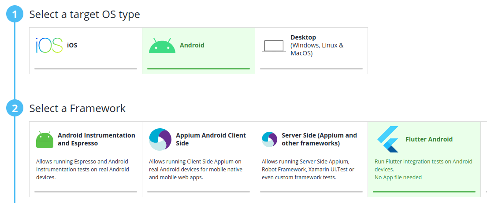
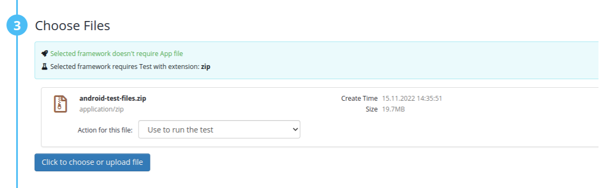

***Flutter Bitbar Cloud***
---------------------------

This sample demonstrates how to run Flutter tests in Bitbar Cloud.
The sample is complete and should work "out of the box", except for iOS real device which is work in progress.

**How to make test run in Bitbar Cloud**

To make a test run in the cloud, first use the provided shell scripts `zip-test-files-android.sh` to create test package zip file.
The test package contains the app directory “my_app” and “run-tests.sh” -file. Upload this test package .zip file to “Flutter” type project in Bitbar Cloud.
The actual flutter app is built during test run.

Select "Flutter Android":





These are scripts for creating test package zip files for Android and iOS:
- *zip-test-files-android.sh*
  - creates android integration test package
  - uses run-tests file: `run-tests-android.sh`
- *zip-test-files-android-unit-widget.sh*
  - creates android unit and widget test package
  - uses run-tests file: `run-tests-android-unit-widget.sh`

*Unit tests*
-------------

- does not require device connected
- add in `pubspec.yaml`
  - in `dev_dependencies:`
  - test: any
- create `test` directory
- (optional) create directory for unit tests
- create dart file ending with `_ test`
- add in that file:
  - import app
    - **import 'package:my_app/main.dart';**
- run unit tests **flutter test test/unit/main_test.dart**


*Widget tests*
-------------

- does not require device connected
- add in `pubspec.yaml`
  - in `dev_dependencies:`
  - test: any
- create `test` directory
- (optional) create directory for widget tests
- create dart file ending with `_ test`
- add in that file:
  - import app
    - **import 'package:my_app/main.dart';**
- run widget tests **flutter test test/widget/main_test.dart**


*JUnit Report*
-------------

- https://pub.dev/packages/junitreport
- converts results of dart tests to JUnit xml format
- works only with unit and widget tests
- make sure these are in path:
  - `flutter/.pub-cache/bin`
  - `flutter/bin/cache/dart-sdk/bin`
- install:
  - `flutter pub global activate junitreport`
- add in **pubspec.yaml**
  - in `dev_dependencies:`
    - *junitreport: ^2.0.2*
- run tests:
  - `flutter test --machine | tojunit > TEST-all.xml`


*Integration tests*
--------------------

- add in **pubspec.yaml**
  - in `dev_dependencies:`
  - integration_test:
  - sdk: flutter
- run `flutter packages upgrade`
- create `integration_test` directory
  - add `main_test.dart` (or similar)

In main_test.dart file, enable flutter integration test with main app
- `import 'package:flutter_test/flutter_test.dart';`
- `import 'package:integration_test/integration_test.dart';`
- `import 'package:my_app/main.dart' as app;`

In main_test.dart, use tester commands (for example)
- `await tester.tap(textEditFinder);`

Check installation
- run `flutter doctor` it will show if everything is installed

Run test:
- **flutter test integration_test/main_test.dart**

Integration test results must be converted to some other format.
There is a (crude) sample how to display at least that all tests passed or some failed.
Look more info from "run-tests-*.sh files".


*screenshots*
-------------

Follow the official guide (preferably)
- https://github.com/flutter/flutter/tree/master/packages/integration_test#screenshots

- create `test_driver` directory
  - add `integration_test.dart` (or similar)

In integration_test.dart file

```dart
import 'dart:io';
import 'package:integration_test/integration_test_driver_extended.dart';

Future<void> main() async {
  await integrationDriver(
    onScreenshot: (String screenshotName, List<int> screenshotBytes) async {
      final File image = File('$screenshotName.png');
      image.writeAsBytesSync(screenshotBytes);
      return true;
    },
  );
}
```

Create a helper for taking screenshots:
```dart
import 'dart:io';
import 'package:flutter/foundation.dart' show kIsWeb;

takeScreenshot(tester, binding, name) async {
  if (kIsWeb) {
    await binding.takeScreenshot(name);
    return;
  } else if (Platform.isAndroid) {
    await binding.convertFlutterSurfaceToImage();
    await tester.pumpAndSettle();
  }
  await binding.takeScreenshot(name);
}

```

Take screenshots in tests:
`await takeScreenshot(tester, binding, 'Screenshot-1');`

Run test:
- **flutter drive --driver=test_driver/integration_test.dart --target=integration_test/main_test.dart**
