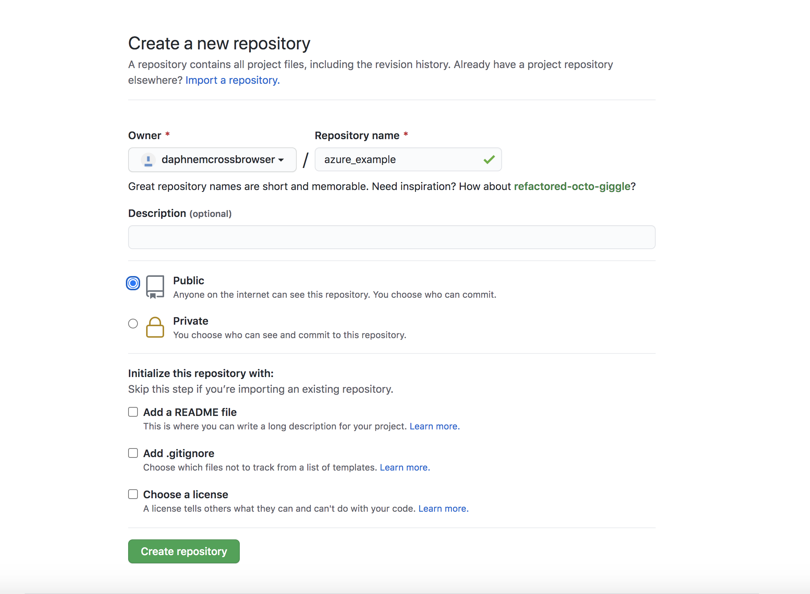
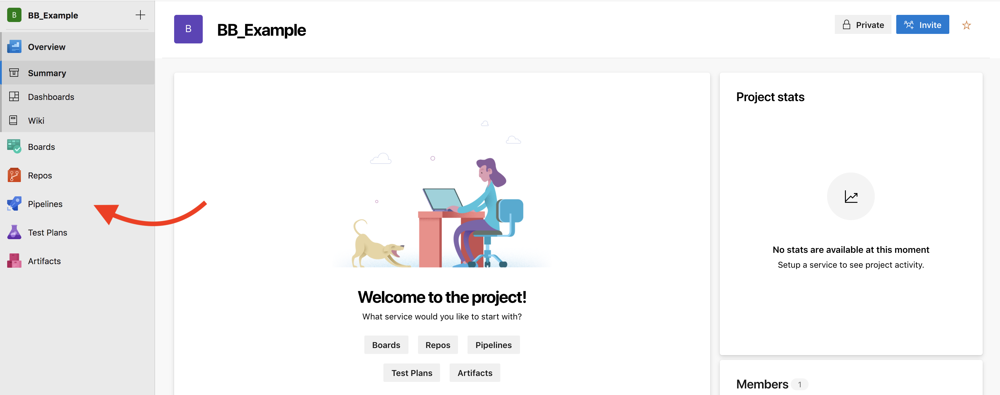
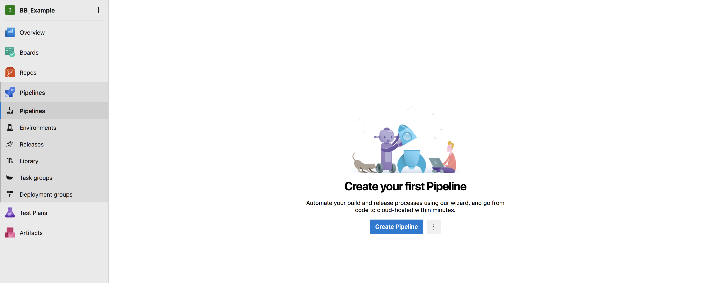
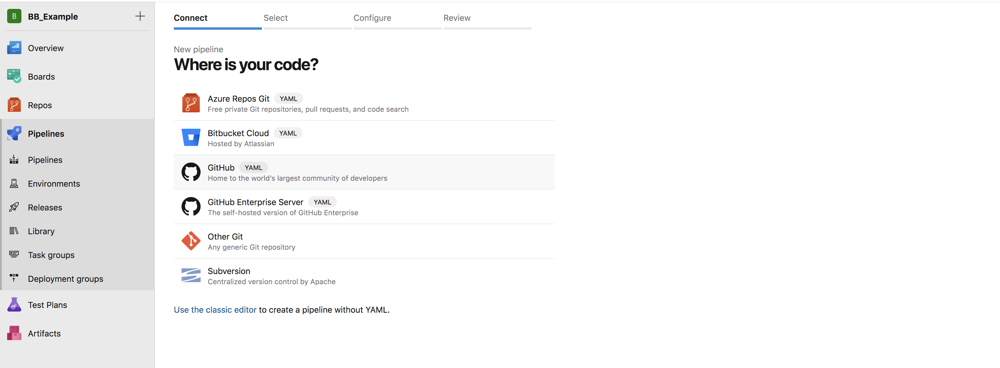
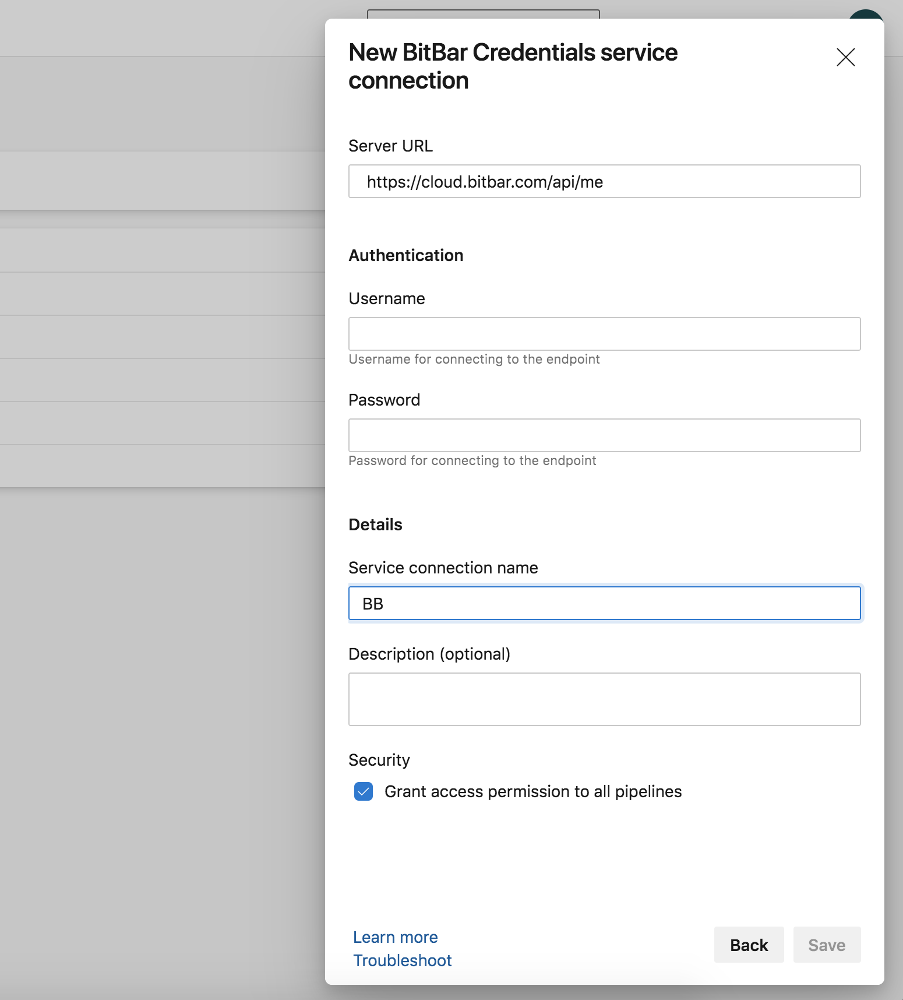
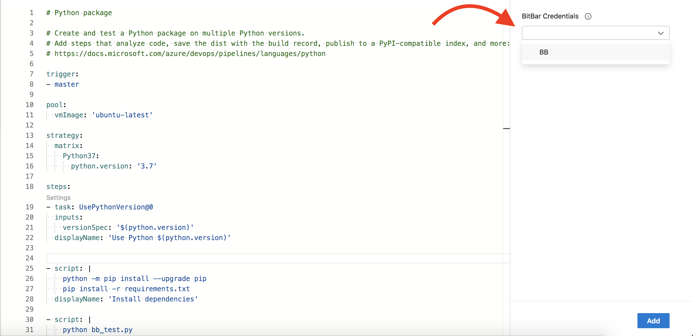
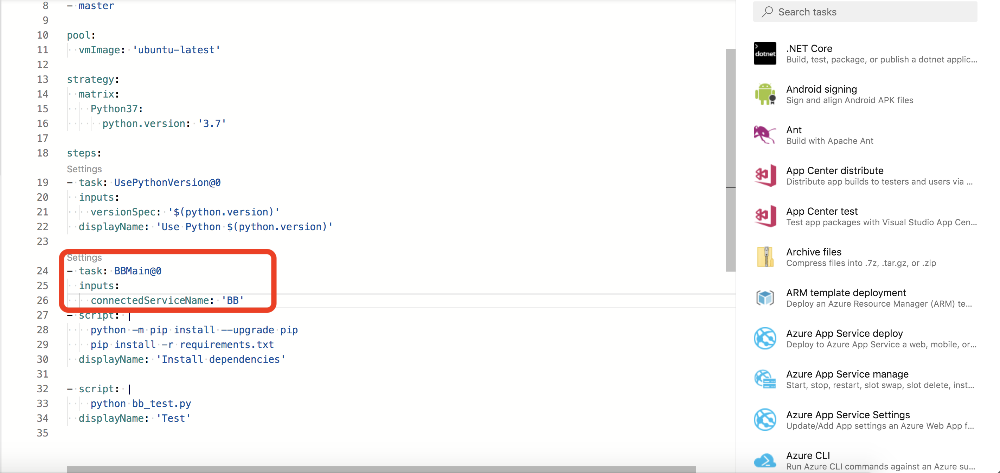

<h2><strong>Getting Started with Azure Pipelines and BitBar</strong></h2>

<em>For this document, we provide complete example files in our <a href="https://github.com/bitbar/test-samples/tree/master/samples/tools/azure-pipelines-extension">Azure Pipelines Github Repository</a>.</em>

<a href="https://docs.microsoft.com/en-us/azure/devops/pipelines/get-started/what-is-azure-pipelines?view=azure-devops">Azure Pipelines</a> is a continuous integration tool that lets you automate your development process quickly, safely, and at scale. Through Azure Pipelines' integration with GitHub, GitHub Enterprise, Azure Repos Git &amp; TFVC, Bitbucket Cloud, and Subversion, every time you commit code, a build is created and automatically run in a clean container or virtual machine, allowing you to test every commit.

In this guide we will use Azure Pipelines with Github for testing using the Appium and the Python programming language.

<h3>Setting up Azure Pipelines</h3>

1. Sign into your Azure DevOps organization or follow the detailed guide <a href="https://docs.microsoft.com/en-us/azure/devops/pipelines/get-started/pipelines-sign-up?view=azure-devops">here</a> to create a new one.

2. Install the <a href="https://marketplace.visualstudio.com/items?itemName=BitBar.bb-tasks">BitBar for Azure DevOps</a> extension for your organization

3. Navigate to your GitHub account and <a href="https://github.com/new">create a new repository</a>.

<h4></h4>

4. Add test files from the <a href="https://github.com/bitbar/test-samples/tree/master/samples/tools/azure-pipelines-extension">example repository</a> 

<h4><strong>Building Your Pipeline</strong></h4>

1. From the <a href="https://dev.azure.com/">Azure DevOps dashboard Dashboard</a>, create a new project and select Pipelines

2. Create a new pipeline  and set up your GitHub repo

3. Add a new Service Connection from the Project Settings page using the type BitBar Credentials

4. Add the BitBar Configuration task to your azure-pipelines.yml file

5. Save and Run

You should see your build start to run in Azure Pipelines and in the BitBar app <a href="https://cloud.bitbar.com/#testing/projects">here</a>.

If you have any questions or concerns, feel <a href="https://support.smartbear.com/bitbar/docs/index.html">free to get in touch</a>.

